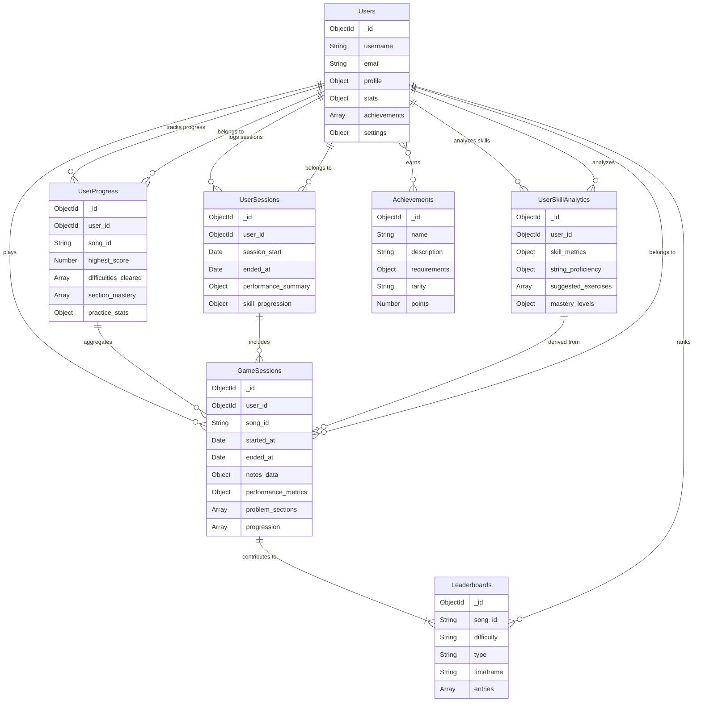

# RiffRoulette: Interactive Guitar Learning Game

Project files created on the repository by `Akshat Namdeo` for the hackathon **[UGAHacks X](https://ugahacks.com/)** and are submitted for the following tracks:

- **Main Tracks:**
    - [UGAHacks AI Track](#)
    - [UGAHacks Best Overall](#)
    - [UGAHacks Best First Time Hacker](#)
    - [UGAHacks Game Track](#)
- **Sponsor Tracks:**
    - [Pinata Challenge](#sponsor-challenges)
    - [Best Use of MongoDB Atlas](#sponsor-challenges)
    - [HPCC Systems Music is Life Challenge](#sponsor-challenges)
    - [Best Domain Name from GoDaddy Registry](#sponsor-challenges)

## Quick Description

**RiffRoulette** is a guitar-based game through which users can create, perfect, and learn their craft. This Gen AI solution for musicians allows you to upload your own audio samples (or choose from 50 preprocessed famous tracks) and freestyle on them. Currently mapped to keyboard keys (Q, W, E, R, T, Y), the game combines real-time audio processing, adaptive difficulty, and dynamic scoring to offer a unique learning experience.

## Table of Contents

- [Overview](#overview)
- [Technical Architecture](#technical-architecture)
    - [Backend](#technical-architecture---backend)
    - [Frontend](#technical-architecture---frontend)
- [Game Flow](#game-flow)
- [Gen AI & Adaptive Difficulty](#gen-ai--adaptive-difficulty)
- [MongoDB Data Storage & Schema](#mongodb-data-storage--schema)
- [HPCC Integration](#hpcc-integration)
- [Preprocessing & Pinata Integration](#preprocessing--pinata-integration)
- [Models & Credits](#models--credits)
- [Sponsor Challenges](#sponsor-challenges)
- [Challenges & Future Work](#challenges--future-work)
- [Acknowledgements](#acknowledgements)

## Overview

**RiffRoulette** is designed to empower a wide variety of users—from beginners learning guitar basics to indie rock artists refining their performance skills. At its core, the project demonstrates how Gen AI can be used as a tool for creative and technical growth in music, rather than something to be feared. By dynamically adapting to your performance, our system helps you build confidence, improve timing and precision, and explore improvisation in an engaging, game-like setting.

## Technical Architecture - Backend

The backend is built using **FastAPI** for real-time API endpoints and **Uvicorn** as the ASGI server. It is organized into two main folders: `backend/app` and `backend/database`, along with an `HPCC Preprocessing` folder for our HPCC-related scripts and processed audio files.

#### Running the Backend

1. Open `backend` folder:
    
        cd backend

2. Install the dependencies:
    
        pip install -r requirements.txt
    
3. Run the server:
    
        python -m uvicorn app.main:app --reload

#### Directory Structure

- **backend/**
    - **app/**
        - **api/**  
          Contains the FastAPI endpoints (including the websocket endpoints for super fast, long-lasting communication).
        - **core/**  
          Holds containers and configuration files.
        - **models/**  
          Contains four different models:
            - Three pretrained models (Demucs, Onset & Frames, Music VAE).
            - One adaptive mutation model (our own trained version).  
          *Note:* The actual model checkpoints are not included; this folder holds their initialization, training, and configuration codes.
        - **services/**  
          Houses the key classes (e.g., `Inference`, `Scoring`, `AudioProcessor`, etc.).
    - **database/**  
      Contains scripts for creating and populating the MongoDB cluster/database.
    - **HPCC Preprocessing/**  
      Contains:
        - Processed audio files and labels (also stored on Pinata for the sponsor challenge).
        - Main solution ECL files needed for the HPCC sponsor challenge.
        - Preprocessing scripts.
    - **requirements.txt**  
      Lists all Python dependencies.

## Technical Architecture - Frontend

The frontend is built with **Next.js** and **MaterialUI** to create a responsive, interactive user interface. It handles the dynamic note visualization (Guitar Hero-style) and communicates with the backend via WebSockets for real-time gameplay feedback.

#### Running the Frontend

1. Open `frontend` folder:
    
        cd frontend

2. Install dependencies:
    
        npm install
    
3. Start the development server:
    
        npm run dev
    
3. Navigate to [http://localhost:3000/playground](http://localhost:3000/playground) to try out the game.

## Game Flow

1. **User Input:**  
   The user can either upload their own audio file or select from 50 preprocessed famous audio tracks.

2. **Audio Processing:**  
   Two key models process the audio:
    - **Demucs Model:**  
      Separates the audio into various aspects.
    - **Onset & Frames Model:**  
      Analyzes the audio to extract guitar riffs and timing information, returning these details to the frontend.

3. **Gameplay:**  
   The frontend displays a dynamic, scrolling note visualization where the player must hit notes in sync. The game features:
    - Real-time scoring and combo multipliers.
    - An option to simulate a perfect run for inspiration or demonstration.

4. **Adaptive Learning:**  
   Two additional models drive the Gen AI capabilities:
    - **Adaptive Mutation Model (Our Own):**  
      If the user performs well, this model introduces "problem sections" by dynamically altering or removing notes. During these sections, the player can choose to improvise.
    - **Music VAE:**  
      Works in tandem with the adaptive mutation model by detecting successful improvisations and generating similar notes to extend the track until the next improvisation opportunity.
      
   Performance metrics (timing, precision, rhythmic details) are continuously monitored and stored in MongoDB for adaptive feedback.

## Gen AI & Adaptive Difficulty

Our system leverages Gen AI to offer an adaptive learning experience:
- **Adaptive Mutation:**  
  Introduces challenging sections by altering the standard note sequence based on the player's performance.
- **Dynamic Improvisation:**  
  Detects and rewards creative playing by dynamically generating similar musical phrases when the player hits impressive notes.

This approach not only improves technical skills but also encourages musical creativity and improvisation, making the learning process both challenging and engaging.

## MongoDB Data Storage & Schema

All user data, game sessions, performance metrics, and progress analytics are stored in MongoDB. Below is an excerpt of our Python script that sets up the database with multiple collections and validation rules:

    from pymongo import MongoClient
    from pymongo.errors import CollectionInvalid
    import logging
    from typing import List, Dict
    import os
    from datetime import datetime
    
    # Configure logging
    logging.basicConfig(level=logging.INFO)
    logger = logging.getLogger(__name__)
    
    class RiffRouletteDBSetup:
        def __init__(self, connection_string: str):
            """Initialize database connection"""
            try:
                self.client = MongoClient(connection_string)
                self.db = self.client.riff_roulette  # database name
                logger.info("Successfully connected to MongoDB")
            except Exception as e:
                logger.error(f"Failed to connect to MongoDB: {str(e)}")
                raise
    
        def create_collections(self):
            """Create all required collections with validators"""
            try:
                # Users Collection
                self.create_users_collection()
                
                # GameSessions Collection
                self.create_game_sessions_collection()
                
                # UserProgress Collection
                self.create_user_progress_collection()
                
                # Achievements Collection
                self.create_achievements_collection()
                
                # Leaderboards Collection
                self.create_leaderboards_collection()
                
                # UserSessions Collection
                self.create_user_sessions_collection()
                
                # UserSkillAnalytics Collection
                self.create_user_skill_analytics_collection()
                
                # Create indexes
                self.create_indexes()
                
                logger.info("Successfully created all collections and indexes")
                
            except Exception as e:
                logger.error(f"Error creating collections: {str(e)}")
                raise
    
        # ... (other collection creation methods)
        
### ER Diagram of the Database Schema

## HPCC Integration

We actively participated in the HPCC challenge and solved almost all the ECL questions that were part of the challenge. These results can be viewed using these identifiers-

        User: TeamMunde
        BWR1_MusicMozChallenge.ecl - W20250209-121221
        BWR2_MSDChallenge.ecl - W20250209-121300
        BWR3_SpotifyChallenge.ecl - W20250209-120939
        BWR4_BonusChallenge.ecl - W20250209-122035

We also utilized HPCC Systems to analyze various datasets and determine the best rock n roll tracks to feature in our game. The following ECL script processes the music dataset by filtering rock-related genres and computing a composite score based on musical attributes:

        IMPORT $;
        SpotMusic := $.File_Music.SpotDS;
        
        // Define rock-related genres
        RockGenres := ['alt-rock', 'hard-rock', 'heavy-metal', 'psych-rock', 'punk-rock', 'rock', 'rock-n-roll'];
        
        // Layout for unified structure
        UnifiedLayout := RECORD
            STRING title;
            STRING375 artist_name;
            STRING genre;
            REAL score;
        END;
        
        RockFiltered := SpotMusic(genre IN RockGenres);
        
        // Output the raw data before score processing
        OUTPUT(RockFiltered, NAMED('Rock_Related_Songs_Before_Scoring'));
        
        // Filter and score for rock-related genres
        SpotScored := PROJECT(RockFiltered,
            TRANSFORM(UnifiedLayout,
                SELF.title := LEFT.track_name;
                SELF.artist_name := LEFT.artist_name;
                SELF.genre := LEFT.genre;
                SELF.score := (0.2 * (REAL)LEFT.tempo) + 
                              (0.2 * (REAL)LEFT.loudness) + 
                              (0.15 * (REAL)(LEFT.danceability)) +
                              (0.15 * (REAL)(LEFT.energy)) +
                              (0.15 * (REAL)(LEFT.instrumentalness))));
        
        // Filter and sort the dataset
        FilteredScored := SpotScored(score > 0);
        SortedScored := SORT(FilteredScored, -score);
        
        // Top 100 unique songs
        Top100 := CHOOSEN(SortedScored, 100);
        
        OUTPUT(Top100, NAMED('Top_100_Rock_Related_Songs_With_Scores'));

**Score Explanation:**  
The composite score for each track is calculated by taking weighted contributions from:
- **Tempo (20%)**
- **Loudness (20%)**
- **Danceability (15%)**
- **Energy (15%)**
- **Instrumentalness (15%)**

This approach allows us to rank tracks based on a blend of rhythmic and sonic qualities that are most appealing for a rock n roll vibe.

## Preprocessing & Pinata Integration

### Note Extraction Example

During preprocessing, audio files are analyzed to extract note details. Here’s a sample JSON output representing the extracted notes:

        [
            {
                "id": 0,
                "pitch": 29,
                "string": "E",
                "velocity": 99,
                "start": 0.0,
                "end": 0.28800000000000003
            },
            {
                "id": 1,
                "pitch": 39,
                "string": "E",
                "velocity": 116,
                "start": 0.0,
                "end": 0.28800000000000003
            },
            {
                "id": 2,
                "pitch": 57,
                "string": "B",
                "velocity": 126,
                "start": 0.0,
                "end": 0.928
            }
        ]

### Uploading to Pinata: Optimization & Dynamic Retrieval

Our integration with Pinata is designed for both optimization and ease of dynamic data retrieval:

- **Optimization:**  
  We use asynchronous HTTP requests via `aiohttp` with a 30-second timeout to ensure rapid and efficient file uploads. Files are wrapped within a directory (`wrapWithDirectory`) to facilitate structured storage. Custom pinning options (`customPinPolicy`) replicate files across multiple regions (FRA1 and NYC1), ensuring high availability and reliability.

- **Metadata & Indexing:**  
  Each file is uploaded with detailed metadata (e.g., song ID, format, artist, title, timestamp, compression details). The IPFS hash (CID) returned by Pinata is dynamically indexed, which allows our system to quickly reference and retrieve files.

- **Dynamic Retrieval:**  
  By indexing CIDs, the system can efficiently load audio or JSON data from IPFS during gameplay. This approach not only optimizes storage but also enhances performance for our Gen AI music processing pipeline.

Below is an excerpt from our Pinata integration script illustrating these optimizations:

        import requests
        import json
        import os
        import re
        from pathlib import Path
        from typing import Dict, List, Optional, Tuple
        import asyncio
        import aiohttp
        from datetime import datetime, timedelta
        from tqdm import tqdm
        from dotenv import load_dotenv
        
        class PinataManager:
            def __init__(self, api_key: str, api_secret: str):
                self.api_key = api_key
                self.api_secret = api_secret
                self.base_url = "https://api.pinata.cloud"
                # Use API key authentication headers for all requests
                self.headers = {
                    'pinata_api_key': api_key,
                    'pinata_secret_api_key': api_secret
                }
        
            async def pin_file_to_ipfs(self, file_path: Path, metadata: Dict) -> Dict:
                """Pin a file to IPFS with metadata and customized pinning options."""
                url = f"{self.base_url}/pinning/pinFileToIPFS"
                
                # Customize pinning options
                pinataOptions = {
                    "cidVersion": 1,
                    "wrapWithDirectory": True,
                    "customPinPolicy": {
                        "regions": [
                            {"id": "FRA1", "desiredReplicationCount": 2},
                            {"id": "NYC1", "desiredReplicationCount": 2}
                        ]
                    }
                }
                
                timeout = aiohttp.ClientTimeout(total=30)  # 30-second timeout
                async with aiohttp.ClientSession(timeout=timeout) as session:
                    with open(file_path, 'rb') as file:
                        form = aiohttp.FormData()
                        form.add_field('file', file)
                        form.add_field('pinataOptions', json.dumps(pinataOptions))
                        form.add_field('pinataMetadata', json.dumps(metadata))
                        async with session.post(url, data=form, headers=self.headers) as response:
                            return await response.json()
        
            async def create_submarine_pin(self, cid: str, duration_hours: int = 24) -> Dict:
                """Create a submarine (temporary) pin."""
                url = f"{self.base_url}/pinning/createSubmarinePin"
                
                data = {
                    "cid": cid,
                    "timeoutInSeconds": duration_hours * 3600
                }
                
                timeout = aiohttp.ClientTimeout(total=30)
                async with aiohttp.ClientSession(timeout=timeout) as session:
                    async with session.post(url, json=data, headers=self.headers) as response:
                        return await response.json()
        
            async def pin_json_to_ipfs(self, json_data: Dict, metadata: Dict) -> Dict:
                """Pin JSON data to IPFS."""
                url = f"{self.base_url}/pinning/pinJSONToIPFS"
                
                data = {
                    "pinataContent": json_data,
                    "pinataMetadata": metadata,
                    "pinataOptions": {
                        "cidVersion": 1
                    }
                }
                
                timeout = aiohttp.ClientTimeout(total=30)
                async with aiohttp.ClientSession(timeout=timeout) as session:
                    async with session.post(url, json=data, headers=self.headers) as response:
                        response_data = await response.json()
                        if 'IpfsHash' not in response_data:
                            print("Full Pinata response:", response_data)
                            raise Exception("No IpfsHash in Pinata response")
                        return response_data

## Models & Credits

This project leverages three key models:
- **Demucs:** For audio source separation.
- **Onset & Frames:** For precise note and timing detection.
- **Music VAE:** For generating new musical phrases.

While these models form the backbone of our audio processing, our innovation lies in integrating them within a **Gen AI** framework. Our proprietary **Adaptive Mutation Model** dynamically adjusts gameplay difficulty by introducing challenges and rewarding improvisation in real time.

## Sponsor Challenges

For details on our participation in the sponsor challenges (such as the **Pinata Challenge**, **Best Use of MongoDB Atlas**, **HPCC Systems Music is Life Challenge**, and **Best Domain Name from GoDaddy Registry**), please refer to the respective sections above. Each challenge has been integrated into our project to demonstrate innovative use cases of technology in music and gaming.

## Challenges & Future Work

One of the major challenges we faced was the strict time limitation during the hackathon. Despite this, we are extremely proud of our progress. Moving forward, we plan to:
- Enhance the adaptive difficulty algorithms.
- Incorporate more advanced audio processing techniques.
- Expand support to include real guitar inputs alongside keyboard mappings.
- Further refine our Gen AI system to create even more engaging musical experiences.

Our aim is to promote the idea that Gen AI is here to empower musicians to explore, learn, and grow, rather than replace traditional skills.

## Acknowledgements

- **UGAHacks X** for hosting the event.
- The developers and maintainers of **Demucs**, **Onset & Frames**, and **Music VAE**.
- **HPCC Systems** and **Pinata** for their sponsorship challenges and support.
- All the contributors who helped bring **RiffRoulette** to life.

For any questions or further discussion, feel free to reach out or open an issue in this repository.
